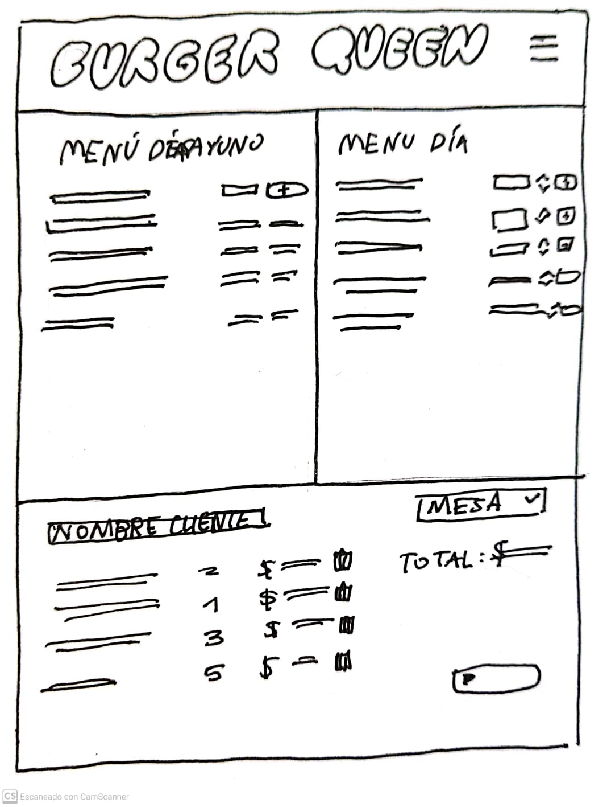
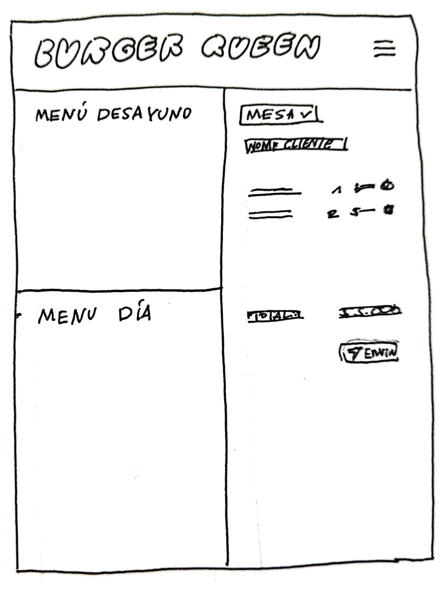
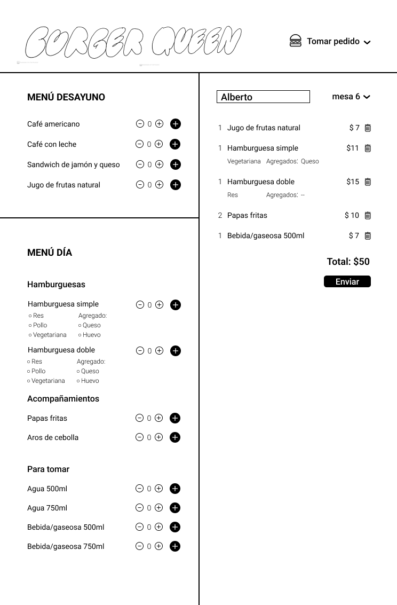
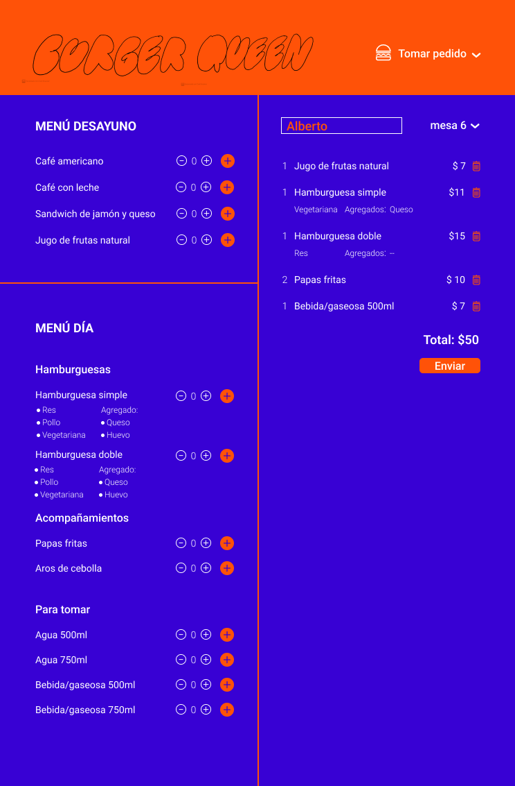
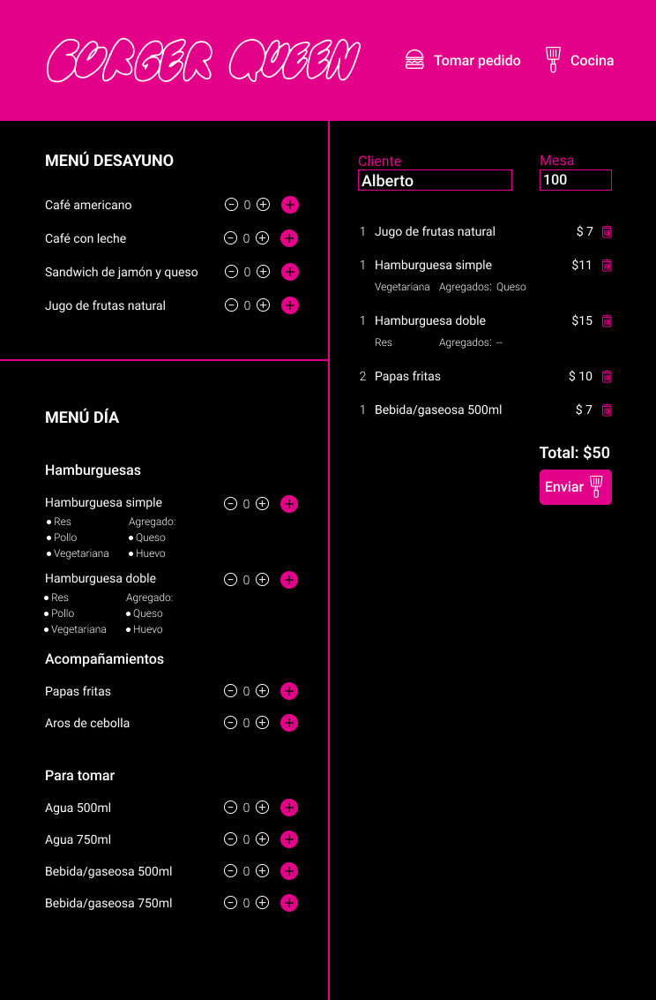
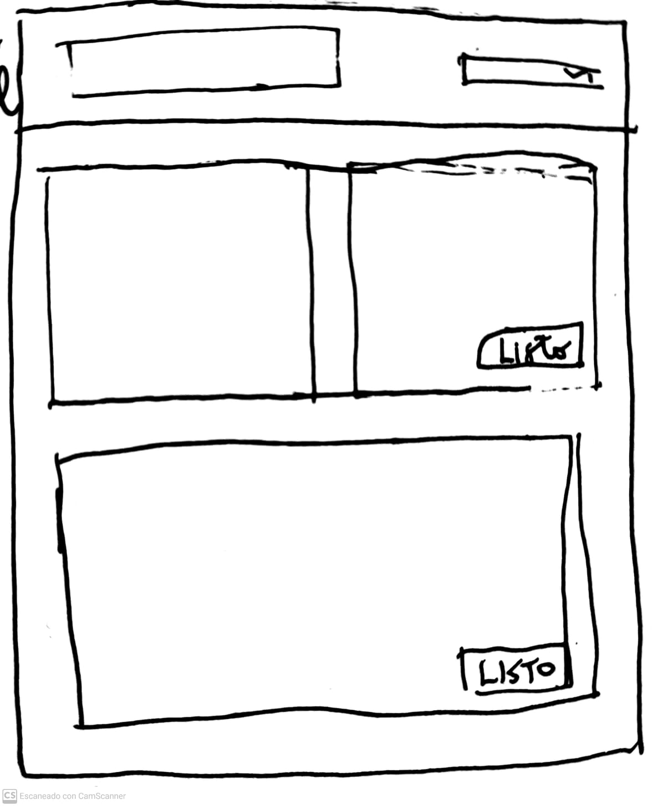
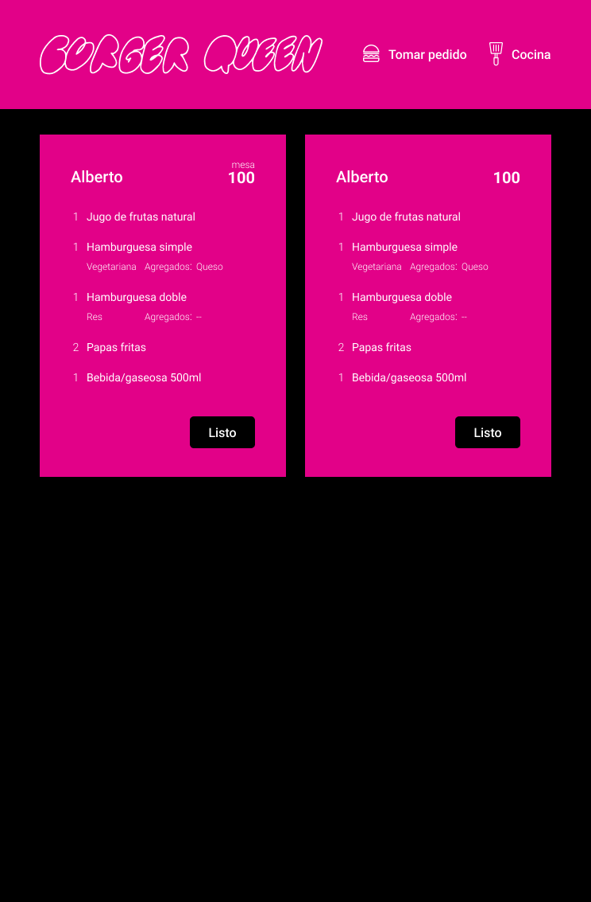

***

<!-- [Ingresa a Burger Queen](src/index.html) -->

Burger Queen es un aplicación pensada para un restaurante de comida rápida. 

Esta busca optimizar los procesos de atención al cliente, tanto en la toma de pedido como en la cocina. 

Permitiendo al mesero tomar un pedido de manera mucho más rápida y efectiva y que con un simple botón pueda enviar la orden a la cocina, y este sea preparado a tiempo.

Esta aplicación posee características técnicas como ser Single Page Application (SPA), manejar una base de datos con Firebase y Firestore; y también utilizar el framework de React y React Router. 

<!--  -->

## Índice

* [1. Historias de Usuario](#1-historias-de-usuario)
  * [1.1 HU 1](#1.1-hu1)
  * [1.2 HU 2](#1.2-hu2)
* [2. Tecnologías](#1-tecnologías)

## Historias de Usuario

Un pequeño restaurante de hamburguesas, que está creciendo, necesita una interfaz en la que puedan tomar pedidos usando una _tablet_, y enviarlos
a la cocina para que se preparen ordenada y eficientemente

<!-- Burger Queen es una cadena de comida rápida que está abierta las 24hrs, y para que puedan seguir creciendo necesita un sistema que ayude a sus meseros a la hora de tomar los pedidos de sus clientes, mediante una tablet. -->
El restaurant consta de dos menús: uno para el desayuno y otro menú para el resto del día.

### HU 1
#### **Mesero debe poder tomar pedido del cliente**

Yo como mesero quiero tomar el pedido de un cliente, saber cuánto cobrar, y enviarlo a la cocina para evitar errores y que se puedan ir preparando en orden.

**Criterios de Aceptación:**

- Visualizar ambos menús
- Anotar nombre de cliente.
- Agregar número de mesa
- Agregar productos al pedido.
- Eliminar productos.
- Ver resumen y el total de la compra.
- Enviar pedido a cocina (guardar en alguna base de datos).
- Se ve y funciona bien en una tablet

#### **Prototipos**

### HU2
#### **Jefe de cocina debe ver los pedidos**

Yo como jefe de cocina quiero ver los pedidos de los clientes en orden y marcar cuáles están listos para saber qué se debe cocinar.

**Criterios de Aceptación:**

- Ver los pedidos ordenados según se van haciendo.
- Marcar los pedidos que se han preparado y están listos para servirse.

#### **Prototipos**

### Tecnologías

Palabras clave: JavaScript, React, Firebase, CSS, Git, GitHub, Visual Studio Code, Figma.
